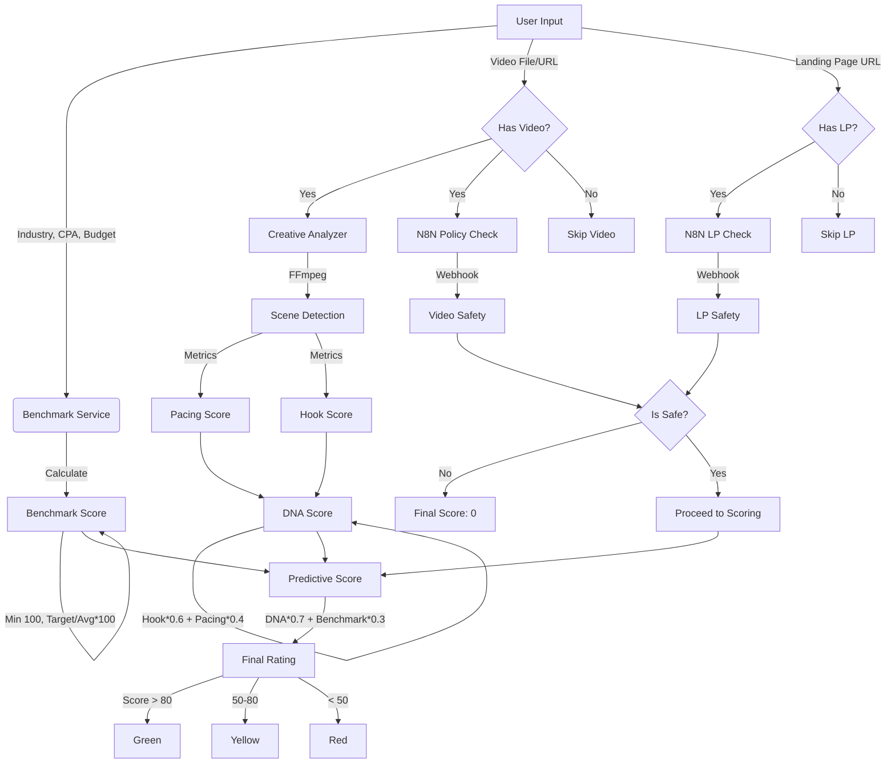

# Analysis & Scoring Flow

This document outlines the logic behind the Pre-flight Check analysis engine.

## Visual Flowchart

## Detailed Logic

### 1. Benchmark Score (30% Weight)
Comparing your Target CPA against Industry Standards (2025 Estimations).
*   **Formula**: `Min(100, (Your Target CPA / Industry Average) * 100)`
*   **Logic**: If you are willing to pay more than the average (higher bid), your success probability increases.

### 2. Creative DNA Score (70% Weight)
Analyzes the structure of your video content.
*   **Formula**: `(Hook Score * 0.6) + (Pacing Score * 0.4)`
*   **Components**:
    *   **Hook Score**: Analyzes first 3 seconds.
        *   Base: 30 points.
        *   Fast Cuts (scene length <= 3s) in intro: +40 points.
    *   **Pacing Score**: Analyzes average scene duration.
        *   **Excellent (1.5s - 2.5s)**: 100 points.
        *   **Fast (< 1.5s)**: 80 points.
        *   **Slow (> 4.0s)**: 40 points.

### 3. Policy & Safety
Before calculating the final score, the system checks for violations.
*   **Video**: AI analysis via N8N for banned content/text.
*   **Landing Page**: AI analysis via N8N for compliance.
*   **Result**: If **ANY** violation is found, the **Final Score is 0** and Rating is **Red**.

### 4. Final Predictive Score
Combines creative quality with market bidding competitiveness.
*   **Formula**: `(DNA Score * 0.7) + (Benchmark Score * 0.3)`

### 5. Final Rating
*   🟢 **Green**: Score > 80
*   🟡 **Yellow**: Score 50 - 80
*   🔴 **Red**: Score < 50 or Policy Violation
